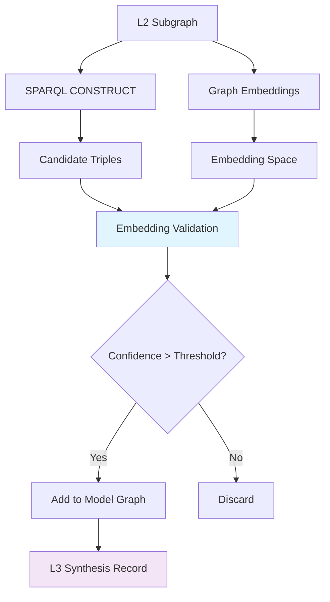

# Nodalync Knowledge Model: RDF Implementation Design

**Version:** 1.0  
**Date:** February 2026  
**Authors:** Subagent (Research & Design)

## Executive Summary

This document provides an implementation-ready design for mapping Nodalync's L0→L1→L2→L3 cognitive architecture to RDF graphs with SPARQL querying. The design integrates with the existing Rust codebase while enabling the dual-graph architecture (Reality vs Model) and hybrid symbolic-subsymbolic reasoning required for the cognitive loops.

**Key Decisions:**
- **Oxigraph** as the primary triplestore (Rust-native, SPARQL 1.1, embedded/server modes)
- **Named Graphs** for Reality/Model separation and provenance tracking
- **Custom Nodalync Ontology** extending Schema.org for cognitive architecture concepts
- **SPARQL CONSTRUCT** for L3 synthesis with embedding validation
- **Incremental integration** path preserving existing SQLite infrastructure

## 1. RDF Graph Architecture

### 1.1 Knowledge Layer Mapping

The Nodalync cognitive model maps to RDF as follows:

```turtle
# L0 (Raw Sources) - Reified as Documents with provenance
<doc:123abc> a ndl:L0Document ;
    dc:created "2026-02-18T19:33:00Z"^^xsd:dateTime ;
    ndl:contentHash "sha256:abc123..." ;
    ndl:sourceUri "file:///vault/notes/ai-research.md" ;
    ndl:contentType "text/markdown" .

# L1 (Mentions) - Bridge entities linking L0 to L2
<mention:456def> a ndl:L1Mention ;
    ndl:sourceDocument <doc:123abc> ;
    ndl:textSpan "OpenAI released GPT-4" ;
    ndl:startOffset 142 ;
    ndl:endOffset 165 ;
    ndl:confidence 0.92 .

# L2-Reality (Verified Facts) - Conservative knowledge graph
GRAPH <ndl:reality> {
    <entity:openai> a schema:Organization ;
        rdfs:label "OpenAI" ;
        ndl:confidence 0.95 ;
        ndl:firstSeen "2026-02-18T10:00:00Z"^^xsd:dateTime ;
        ndl:sourceCount 15 .
    
    <entity:gpt4> a ndl:LanguageModel ;
        rdfs:label "GPT-4" ;
        schema:creator <entity:openai> ;
        ndl:confidence 0.88 .
}

# L2-Model (Agent's Working Worldview) - Includes speculative entities
GRAPH <ndl:model> {
    # All Reality graph triples PLUS:
    <entity:gpt5> a ndl:LanguageModel ;
        rdfs:label "GPT-5" ;
        schema:creator <entity:openai> ;
        ndl:confidence 0.65 ;
        ndl:speculative true ;
        ndl:synthesizedBy <synthesis:789ghi> .
}

# L3 (Synthesis) - Reasoning processes and their outputs
<synthesis:789ghi> a ndl:L3Synthesis ;
    ndl:inputSubgraph [
        a ndl:Subgraph ;
        ndl:centerEntity <entity:openai> ;
        ndl:maxHops 2
    ] ;
    ndl:reasoningMethod "pattern-completion" ;
    ndl:confidence 0.65 ;
    ndl:generatedAt "2026-02-18T19:30:00Z"^^xsd:dateTime ;
    ndl:outputTriples (
        [ rdf:subject <entity:gpt5> ; rdf:predicate rdf:type ; rdf:object ndl:LanguageModel ]
        [ rdf:subject <entity:gpt5> ; rdf:predicate schema:creator ; rdf:object <entity:openai> ]
    ) .
```

### 1.2 Nodalync Ontology Schema

```turtle
# File: ontology/nodalync-core.ttl
@prefix ndl: <https://nodalync.io/ontology/> .
@prefix schema: <http://schema.org/> .
@prefix owl: <http://www.w3.org/2002/07/owl#> .
@prefix rdfs: <http://www.w3.org/2000/01/rdf-schema#> .
@prefix xsd: <http://www.w3.org/2001/XMLSchema#> .

# === KNOWLEDGE LAYER CLASSES ===

ndl:L0Document a owl:Class ;
    rdfs:label "L0 Document" ;
    rdfs:comment "Raw source document with immutable content and provenance" .

ndl:L1Mention a owl:Class ;
    rdfs:label "L1 Mention" ;
    rdfs:comment "Text span in L0 document that refers to an L2 entity" .

ndl:L2Entity a owl:Class ;
    rdfs:label "L2 Entity" ;
    rdfs:comment "Structured entity in the knowledge graph" ;
    rdfs:subClassOf owl:Thing .

ndl:L3Synthesis a owl:Class ;
    rdfs:label "L3 Synthesis" ;
    rdfs:comment "Reasoning process that generates new knowledge" .

# === DOMAIN CLASSES ===

ndl:LanguageModel a owl:Class ;
    rdfs:subClassOf schema:Product ;
    rdfs:label "Language Model" .

ndl:AICompany a owl:Class ;
    rdfs:subClassOf schema:Organization ;
    rdfs:label "AI Company" .

ndl:ResearchPaper a owl:Class ;
    rdfs:subClassOf schema:CreativeWork ;
    rdfs:label "Research Paper" .

# === PROVENANCE PROPERTIES ===

ndl:contentHash a owl:DatatypeProperty ;
    rdfs:domain ndl:L0Document ;
    rdfs:range xsd:string ;
    rdfs:label "content hash" .

ndl:sourceDocument a owl:ObjectProperty ;
    rdfs:domain ndl:L1Mention ;
    rdfs:range ndl:L0Document ;
    rdfs:label "source document" .

ndl:sourceCount a owl:DatatypeProperty ;
    rdfs:domain ndl:L2Entity ;
    rdfs:range xsd:nonNegativeInteger ;
    rdfs:label "source count" .

# === CONFIDENCE PROPERTIES ===

ndl:confidence a owl:DatatypeProperty ;
    rdfs:range xsd:double ;
    rdfs:label "confidence" ;
    rdfs:comment "Confidence score between 0.0 and 1.0" .

ndl:speculative a owl:DatatypeProperty ;
    rdfs:range xsd:boolean ;
    rdfs:label "speculative" ;
    rdfs:comment "True if entity was synthesized, not extracted" .

# === TEMPORAL PROPERTIES ===

ndl:firstSeen a owl:DatatypeProperty ;
    rdfs:range xsd:dateTime ;
    rdfs:label "first seen" .

ndl:lastUpdated a owl:DatatypeProperty ;
    rdfs:range xsd:dateTime ;
    rdfs:label "last updated" .

# === L3 SYNTHESIS PROPERTIES ===

ndl:inputSubgraph a owl:ObjectProperty ;
    rdfs:domain ndl:L3Synthesis ;
    rdfs:label "input subgraph" .

ndl:reasoningMethod a owl:DatatypeProperty ;
    rdfs:domain ndl:L3Synthesis ;
    rdfs:range xsd:string ;
    rdfs:label "reasoning method" .

ndl:synthesizedBy a owl:ObjectProperty ;
    rdfs:range ndl:L3Synthesis ;
    rdfs:label "synthesized by" .

ndl:outputTriples a owl:ObjectProperty ;
    rdfs:domain ndl:L3Synthesis ;
    rdfs:label "output triples" .

# === GRAPH TOPOLOGY ===

ndl:Subgraph a owl:Class ;
    rdfs:label "Subgraph" .

ndl:centerEntity a owl:ObjectProperty ;
    rdfs:domain ndl:Subgraph ;
    rdfs:range ndl:L2Entity .

ndl:maxHops a owl:DatatypeProperty ;
    rdfs:domain ndl:Subgraph ;
    rdfs:range xsd:nonNegativeInteger .
```

### 1.3 Named Graph Structure

```rust
// Core named graphs in the triplestore
pub const REALITY_GRAPH: &str = "https://nodalync.io/graphs/reality";
pub const MODEL_GRAPH: &str = "https://nodalync.io/graphs/model";
pub const SCHEMA_GRAPH: &str = "https://nodalync.io/graphs/schema";
pub const PROVENANCE_GRAPH: &str = "https://nodalync.io/graphs/provenance";

// Dynamic named graphs for L3 synthesis sessions
pub fn synthesis_graph(session_id: &str) -> String {
    format!("https://nodalync.io/graphs/synthesis/{}", session_id)
}

// Time-series graphs for historical tracking
pub fn timestamped_graph(timestamp: u64) -> String {
    format!("https://nodalync.io/graphs/snapshots/{}", timestamp)
}
```

## 2. SPARQL Query Patterns

### 2.1 L2 Subgraph Extraction for L3 Reasoning

```sparql
# Extract 2-hop subgraph around OpenAI for reasoning
PREFIX ndl: <https://nodalync.io/ontology/>
PREFIX schema: <http://schema.org/>
PREFIX rdfs: <http://www.w3.org/2000/01/rdf-schema#>

CONSTRUCT {
    ?center ?centerPred ?centerObj .
    ?connected ?connectedPred ?connectedObj .
    ?hop2 ?hop2Pred ?hop2Obj .
    
    # Include confidence metadata
    ?center ndl:confidence ?centerConf .
    ?connected ndl:confidence ?connectedConf .
    ?hop2 ndl:confidence ?hop2Conf .
} WHERE {
    GRAPH <https://nodalync.io/graphs/model> {
        # Center entity
        BIND(<entity:openai> as ?center)
        ?center ?centerPred ?centerObj .
        OPTIONAL { ?center ndl:confidence ?centerConf }
        
        # 1-hop neighbors
        {
            ?center ?relation1 ?connected .
            FILTER(isIRI(?connected))
        } UNION {
            ?connected ?relation1 ?center .
            FILTER(isIRI(?connected))
        }
        
        ?connected ?connectedPred ?connectedObj .
        OPTIONAL { ?connected ndl:confidence ?connectedConf }
        
        # 2-hop neighbors
        OPTIONAL {
            {
                ?connected ?relation2 ?hop2 .
                FILTER(isIRI(?hop2) && ?hop2 != ?center)
            } UNION {
                ?hop2 ?relation2 ?connected .
                FILTER(isIRI(?hop2) && ?hop2 != ?center)
            }
            
            ?hop2 ?hop2Pred ?hop2Obj .
            OPTIONAL { ?hop2 ndl:confidence ?hop2Conf }
        }
    }
}
LIMIT 1000
```

### 2.2 Divergence Detection Between Reality and Model

```sparql
# Find entities that exist in Model but not Reality (potential hallucinations)
PREFIX ndl: <https://nodalync.io/ontology/>
PREFIX rdfs: <http://www.w3.org/2000/01/rdf-schema#>

SELECT ?entity ?label ?confidence ?speculative WHERE {
    GRAPH <https://nodalync.io/graphs/model> {
        ?entity a ndl:L2Entity ;
                rdfs:label ?label ;
                ndl:confidence ?confidence .
        OPTIONAL { ?entity ndl:speculative ?speculative }
    }
    
    FILTER NOT EXISTS {
        GRAPH <https://nodalync.io/graphs/reality> {
            ?entity a ndl:L2Entity .
        }
    }
}
ORDER BY ASC(?confidence)
```

```sparql
# Find property disagreements between Reality and Model
PREFIX ndl: <https://nodalync.io/ontology/>
PREFIX rdfs: <http://www.w3.org/2000/01/rdf-schema#>

SELECT ?entity ?property ?realityValue ?modelValue WHERE {
    GRAPH <https://nodalync.io/graphs/reality> {
        ?entity ?property ?realityValue .
    }
    
    GRAPH <https://nodalync.io/graphs/model> {
        ?entity ?property ?modelValue .
    }
    
    FILTER(?realityValue != ?modelValue)
    FILTER(?property != ndl:confidence)  # Confidence differences are expected
    FILTER(?property != ndl:lastUpdated) # Timestamp differences are expected
}
```

### 2.3 Provenance Chain Traversal

```sparql
# Trace an entity's provenance back to L0 sources
PREFIX ndl: <https://nodalync.io/ontology/>
PREFIX dc: <http://purl.org/dc/elements/1.1/>

SELECT ?entity ?mention ?document ?sourceUri ?created WHERE {
    BIND(<entity:gpt4> as ?entity)
    
    # L2 → L1 link
    ?mention a ndl:L1Mention ;
             ndl:resolvedTo ?entity ;
             ndl:sourceDocument ?document .
    
    # L1 → L0 link
    ?document a ndl:L0Document ;
              ndl:sourceUri ?sourceUri ;
              dc:created ?created .
}
ORDER BY ?created
```

### 2.4 Confidence-Weighted Path Queries

```sparql
# Find paths between entities with minimum confidence threshold
PREFIX ndl: <https://nodalync.io/ontology/>
PREFIX schema: <http://schema.org/>

SELECT ?entity1 ?entity2 ?pathLength ?minConfidence WHERE {
    VALUES (?entity1 ?entity2) { 
        (<entity:openai> <entity:gpt4>)
        (<entity:anthropic> <entity:claude>)
    }
    
    {
        # Direct connection
        GRAPH <https://nodalync.io/graphs/model> {
            ?entity1 ?prop ?entity2 .
            ?entity1 ndl:confidence ?conf1 .
            ?entity2 ndl:confidence ?conf2 .
            BIND(1 as ?pathLength)
            BIND(MIN(?conf1, ?conf2) as ?minConfidence)
        }
    } UNION {
        # 2-hop connection
        GRAPH <https://nodalync.io/graphs/model> {
            ?entity1 ?prop1 ?intermediate .
            ?intermediate ?prop2 ?entity2 .
            ?entity1 ndl:confidence ?conf1 .
            ?intermediate ndl:confidence ?confInt .
            ?entity2 ndl:confidence ?conf2 .
            BIND(2 as ?pathLength)
            BIND(MIN(?conf1, MIN(?confInt, ?conf2)) as ?minConfidence)
        }
    }
    
    FILTER(?minConfidence >= 0.7)
}
ORDER BY ?pathLength DESC(?minConfidence)
```

### 2.5 L3 Synthesis Candidate Generation

```sparql
# CONSTRUCT query to generate L3 synthesis candidates
PREFIX ndl: <https://nodalync.io/ontology/>
PREFIX schema: <http://schema.org/>

CONSTRUCT {
    ?newEntity a ?inferredType ;
               rdfs:label ?inferredLabel ;
               schema:creator ?creator ;
               ndl:confidence ?inferredConfidence ;
               ndl:speculative true ;
               ndl:synthesizedBy ?synthesisId .
} WHERE {
    GRAPH <https://nodalync.io/graphs/model> {
        # Pattern: AI companies create language models
        ?creator a ndl:AICompany ;
                 rdfs:label ?creatorLabel .
        
        ?existingModel a ndl:LanguageModel ;
                       schema:creator ?creator ;
                       rdfs:label ?existingLabel .
        
        # Infer next model in sequence (e.g., GPT-4 → GPT-5)
        BIND(URI(CONCAT("entity:", LCASE(?creatorLabel), "-next-model")) as ?newEntity)
        BIND(ndl:LanguageModel as ?inferredType)
        BIND(CONCAT(?creatorLabel, " Next Generation Model") as ?inferredLabel)
        BIND(0.6 as ?inferredConfidence)  # Lower confidence for synthesis
        BIND(URI(CONCAT("synthesis:", STRUUID())) as ?synthesisId)
    }
}
```

## 3. Dual-Graph Architecture Implementation

### 3.1 Architecture Comparison

| Approach | Pros | Cons | Fit for Nodalync |
|----------|------|------|------------------|
| **Oxigraph Named Graphs** | Native SPARQL, embedded/server modes, Rust-native | Limited to SPARQL reasoning | ✅ **Recommended** |
| **Neo4j Multi-Database** | Rich graph algorithms, production-ready | Not RDF-native, licensing costs | ❌ Architectural mismatch |
| **Custom Graph Store** | Complete control, optimized for use case | High development cost, reinventing wheel | ❌ Premature optimization |

### 3.2 Oxigraph Integration Architecture

```rust
// File: crates/nodalync-graph/src/rdf/mod.rs
use oxigraph::store::{Store, StoreTransaction};
use oxigraph::model::{Graph, NamedNode, Quad, Subject, Term};
use oxigraph::sparql::{Query, QueryResults, QuerySolution};
use anyhow::Result;

pub mod graphs {
    pub const REALITY: &str = "https://nodalync.io/graphs/reality";
    pub const MODEL: &str = "https://nodalync.io/graphs/model";
    pub const SCHEMA: &str = "https://nodalync.io/graphs/schema";
    pub const PROVENANCE: &str = "https://nodalync.io/graphs/provenance";
}

pub struct NodalyncRDFStore {
    store: Store,
    reality_graph: NamedNode,
    model_graph: NamedNode,
    schema_graph: NamedNode,
}

impl NodalyncRDFStore {
    pub fn new(db_path: &std::path::Path) -> Result<Self> {
        let store = Store::open(db_path)?;
        
        Ok(Self {
            store,
            reality_graph: NamedNode::new(graphs::REALITY)?,
            model_graph: NamedNode::new(graphs::MODEL)?,
            schema_graph: NamedNode::new(graphs::SCHEMA)?,
        })
    }
    
    /// Add triple to Reality graph (conservative, L0-sourced only)
    pub fn add_to_reality(&self, subject: impl Into<Subject>, 
                          predicate: NamedNode, 
                          object: impl Into<Term>) -> Result<()> {
        let quad = Quad::new(
            subject.into(),
            predicate,
            object.into(),
            Some(self.reality_graph.clone().into()),
        );
        
        self.store.insert(&quad)?;
        Ok(())
    }
    
    /// Add triple to Model graph (includes speculative L3 outputs)
    pub fn add_to_model(&self, subject: impl Into<Subject>,
                       predicate: NamedNode,
                       object: impl Into<Term>) -> Result<()> {
        let quad = Quad::new(
            subject.into(),
            predicate,
            object.into(),
            Some(self.model_graph.clone().into()),
        );
        
        self.store.insert(&quad)?;
        Ok(())
    }
    
    /// Execute SPARQL query and return results
    pub fn query(&self, sparql: &str) -> Result<QueryResults> {
        let query = Query::parse(sparql, None)?;
        let results = self.store.query(query)?;
        Ok(results)
    }
    
    /// Extract subgraph for L3 reasoning
    pub fn extract_subgraph(&self, center_entity: &str, max_hops: u32) -> Result<Vec<Quad>> {
        let sparql = format!(
            r#"
            PREFIX ndl: <https://nodalync.io/ontology/>
            
            CONSTRUCT {{
                ?s ?p ?o .
            }} WHERE {{
                GRAPH <{}> {{
                    <{}> ((!<>)|<>){{0,{}}} ?s .
                    ?s ?p ?o .
                }}
            }}
            "#,
            graphs::MODEL, center_entity, max_hops
        );
        
        match self.query(&sparql)? {
            QueryResults::Graph(graph) => Ok(graph.collect()),
            _ => Ok(vec![]),
        }
    }
    
    /// Detect divergence between Reality and Model graphs
    pub fn detect_divergence(&self) -> Result<Vec<DivergenceReport>> {
        let sparql = r#"
            PREFIX ndl: <https://nodalync.io/ontology/>
            PREFIX rdfs: <http://www.w3.org/2000/01/rdf-schema#>
            
            SELECT ?entity ?label ?confidence ?inReality ?inModel WHERE {
                {
                    GRAPH <https://nodalync.io/graphs/reality> {
                        ?entity rdfs:label ?label .
                        BIND(true as ?inReality)
                    }
                    OPTIONAL {
                        GRAPH <https://nodalync.io/graphs/model> {
                            ?entity rdfs:label ?label .
                            BIND(true as ?inModel)
                        }
                    }
                } UNION {
                    GRAPH <https://nodalync.io/graphs/model> {
                        ?entity rdfs:label ?label ;
                                ndl:confidence ?confidence .
                        BIND(true as ?inModel)
                    }
                    OPTIONAL {
                        GRAPH <https://nodalync.io/graphs/reality> {
                            ?entity rdfs:label ?label .
                            BIND(true as ?inReality)
                        }
                    }
                }
            }
        "#;
        
        // Process query results into DivergenceReport structs
        todo!("Implement result processing")
    }
    
    /// Sync Reality graph to Model graph (Model is superset of Reality)
    pub fn sync_reality_to_model(&self) -> Result<()> {
        let sparql = format!(
            r#"
            INSERT {{
                GRAPH <{}> {{
                    ?s ?p ?o .
                }}
            }} WHERE {{
                GRAPH <{}> {{
                    ?s ?p ?o .
                }}
                FILTER NOT EXISTS {{
                    GRAPH <{}> {{
                        ?s ?p ?o .
                    }}
                }}
            }}
            "#,
            graphs::MODEL, graphs::REALITY, graphs::MODEL
        );
        
        self.store.update(&sparql)?;
        Ok(())
    }
}

#[derive(Debug, Clone)]
pub struct DivergenceReport {
    pub entity: String,
    pub label: String,
    pub in_reality: bool,
    pub in_model: bool,
    pub confidence: Option<f64>,
    pub divergence_type: DivergenceType,
}

#[derive(Debug, Clone, PartialEq)]
pub enum DivergenceType {
    ModelOnly,      // Potential hallucination
    RealityOnly,    // Model is outdated
    PropertyConflict, // Same entity, different properties
}
```

### 3.3 Bridge to Existing SQLite System

```rust
// File: crates/nodalync-graph/src/bridge.rs
use crate::{L2GraphDB, Entity, Relationship};
use crate::rdf::NodalyncRDFStore;
use oxigraph::model::{NamedNode, BlankNode, Literal};
use anyhow::Result;

/// Bridge between SQLite L2GraphDB and RDF NodalyncRDFStore
pub struct GraphBridge {
    sqlite: L2GraphDB,
    rdf: NodalyncRDFStore,
}

impl GraphBridge {
    pub fn new(sqlite: L2GraphDB, rdf: NodalyncRDFStore) -> Self {
        Self { sqlite, rdf }
    }
    
    /// Migrate SQLite entities to RDF Reality graph
    pub fn migrate_to_rdf(&self) -> Result<()> {
        // Get all entities from SQLite
        let entities = self.sqlite.search_entities("", 10000)?;
        
        for entity in entities {
            self.sync_entity_to_rdf(&entity)?;
        }
        
        // Get all relationships
        // Note: This is a simplified example - real implementation would batch
        // and handle relationships more efficiently
        
        Ok(())
    }
    
    fn sync_entity_to_rdf(&self, entity: &Entity) -> Result<()> {
        let entity_uri = NamedNode::new(&format!("https://nodalync.io/entities/{}", entity.id))?;
        let rdf_type = NamedNode::new("http://www.w3.org/1999/02/22-rdf-syntax-ns#type")?;
        let rdfs_label = NamedNode::new("http://www.w3.org/2000/01/rdf-schema#label")?;
        let ndl_confidence = NamedNode::new("https://nodalync.io/ontology/confidence")?;
        
        // Add rdf:type
        let entity_class = NamedNode::new(&format!(
            "https://nodalync.io/ontology/{}",
            entity.entity_type.replace(" ", "")
        ))?;
        self.rdf.add_to_reality(entity_uri.clone(), rdf_type, entity_class)?;
        
        // Add rdfs:label
        self.rdf.add_to_reality(
            entity_uri.clone(),
            rdfs_label,
            Literal::new_simple_literal(&entity.canonical_label)
        )?;
        
        // Add confidence
        self.rdf.add_to_reality(
            entity_uri.clone(),
            ndl_confidence,
            Literal::new_typed_literal(&entity.confidence.to_string(), 
                                     NamedNode::new("http://www.w3.org/2001/XMLSchema#double")?)
        )?;
        
        Ok(())
    }
}
```

## 4. Reasoning in Semantic Space

### 4.1 Hybrid Symbolic-Subsymbolic Architecture



### 4.2 SPARQL + OWL Entailment Implementation

```rust
// File: crates/nodalync-graph/src/reasoning/symbolic.rs
use oxigraph::store::Store;
use oxigraph::model::{NamedNode, Quad, Term};
use anyhow::Result;

pub struct SymbolicReasoner {
    store: Store,
    schema_rules: Vec<InferenceRule>,
}

#[derive(Debug, Clone)]
pub struct InferenceRule {
    pub name: String,
    pub premise: String,  // SPARQL WHERE clause
    pub conclusion: String, // SPARQL CONSTRUCT clause
}

impl SymbolicReasoner {
    pub fn new(store: Store) -> Self {
        let schema_rules = vec![
            // Transitivity of schema:creator relationships
            InferenceRule {
                name: "creator_transitivity".to_string(),
                premise: r#"
                    ?company a ndl:AICompany .
                    ?model a ndl:LanguageModel ;
                           schema:creator ?company .
                    ?feature schema:partOf ?model .
                "#.to_string(),
                conclusion: r#"
                    ?feature schema:creator ?company .
                "#.to_string(),
            },
            
            // Inverse relationships
            InferenceRule {
                name: "creator_inverse".to_string(),
                premise: r#"
                    ?model schema:creator ?company .
                "#.to_string(),
                conclusion: r#"
                    ?company ndl:created ?model .
                "#.to_string(),
            },
            
            // Type inference from domain/range
            InferenceRule {
                name: "type_from_domain".to_string(),
                premise: r#"
                    ?entity schema:creator ?company .
                    ?company a ndl:AICompany .
                "#.to_string(),
                conclusion: r#"
                    ?entity a schema:CreativeWork .
                "#.to_string(),
            },
        ];
        
        Self { store, schema_rules }
    }
    
    /// Apply all inference rules to generate new triples
    pub fn apply_entailment(&self, target_graph: &str) -> Result<Vec<Quad>> {
        let mut new_triples = Vec::new();
        
        for rule in &self.schema_rules {
            let inference_query = format!(
                r#"
                PREFIX ndl: <https://nodalync.io/ontology/>
                PREFIX schema: <http://schema.org/>
                PREFIX rdfs: <http://www.w3.org/2000/01/rdf-schema#>
                
                CONSTRUCT {{
                    {}
                }} WHERE {{
                    GRAPH <{}> {{
                        {}
                    }}
                }}
                "#,
                rule.conclusion, target_graph, rule.premise
            );
            
            match self.store.query(&inference_query)? {
                oxigraph::sparql::QueryResults::Graph(graph) => {
                    new_triples.extend(graph.collect::<Vec<_>>());
                }
                _ => {} // Not a CONSTRUCT query
            }
        }
        
        Ok(new_triples)
    }
}
```

### 4.3 Embedding-Based Validation

```rust
// File: crates/nodalync-graph/src/reasoning/embeddings.rs
use candle_core::{Tensor, Device};
use candle_nn::{VarBuilder, Module};
use anyhow::Result;

pub struct GraphContextAutoencoder {
    encoder: Box<dyn Module>,
    decoder: Box<dyn Module>,
    device: Device,
}

impl GraphContextAutoencoder {
    pub fn new(device: Device) -> Result<Self> {
        // Simplified GCAE structure - real implementation would be more complex
        todo!("Implement full GCAE architecture")
    }
    
    /// Encode subgraph to latent representation
    pub fn encode_subgraph(&self, subgraph: &[Quad]) -> Result<Tensor> {
        // Convert RDF triples to tensor representation
        let input_tensor = self.serialize_subgraph(subgraph)?;
        
        // Pass through encoder
        let latent = self.encoder.forward(&input_tensor)?;
        
        Ok(latent)
    }
    
    /// Decode latent representation back to graph structure
    pub fn decode_to_triples(&self, latent: &Tensor) -> Result<Vec<(String, String, String)>> {
        let output = self.decoder.forward(latent)?;
        
        // Convert tensor back to triples
        // This is a complex process involving constrained decoding
        self.deserialize_to_triples(&output)
    }
    
    /// Validate candidate triples using embedding similarity
    pub fn validate_candidates(&self, 
                              existing_subgraph: &[Quad], 
                              candidates: &[(String, String, String)]) -> Result<Vec<f32>> {
        // Encode the existing subgraph
        let context_embedding = self.encode_subgraph(existing_subgraph)?;
        
        let mut confidences = Vec::new();
        
        for candidate in candidates {
            // Create augmented subgraph with candidate
            let mut augmented = existing_subgraph.to_vec();
            // Convert candidate to Quad and add
            // augmented.push(candidate_quad);
            
            // Encode augmented subgraph
            let augmented_embedding = self.encode_subgraph(&augmented)?;
            
            // Calculate similarity/likelihood
            let confidence = self.calculate_likelihood(&context_embedding, &augmented_embedding)?;
            confidences.push(confidence);
        }
        
        Ok(confidences)
    }
    
    fn serialize_subgraph(&self, subgraph: &[Quad]) -> Result<Tensor> {
        // Convert RDF quads to numerical tensor
        // This involves entity/predicate embeddings and graph convolution
        todo!("Implement subgraph serialization")
    }
    
    fn deserialize_to_triples(&self, tensor: &Tensor) -> Result<Vec<(String, String, String)>> {
        // Convert decoder output back to valid RDF triples
        // Requires constrained decoding and vocabulary mapping
        todo!("Implement tensor deserialization")
    }
    
    fn calculate_likelihood(&self, context: &Tensor, augmented: &Tensor) -> Result<f32> {
        // Compare embeddings to determine how likely the augmented graph is
        // Could use cosine similarity, KL divergence, or learned metric
        todo!("Implement likelihood calculation")
    }
}
```

### 4.4 L3 Synthesis Pipeline

```rust
// File: crates/nodalync-graph/src/reasoning/l3_synthesis.rs
use crate::rdf::NodalyncRDFStore;
use crate::reasoning::{SymbolicReasoner, GraphContextAutoencoder};
use uuid::Uuid;
use anyhow::Result;

pub struct L3SynthesisPipeline {
    rdf_store: NodalyncRDFStore,
    symbolic_reasoner: SymbolicReasoner,
    gcae: GraphContextAutoencoder,
    confidence_threshold: f32,
}

impl L3SynthesisPipeline {
    pub fn new(rdf_store: NodalyncRDFStore, 
               symbolic_reasoner: SymbolicReasoner,
               gcae: GraphContextAutoencoder) -> Self {
        Self {
            rdf_store,
            symbolic_reasoner,
            gcae,
            confidence_threshold: 0.6,
        }
    }
    
    /// Main L3 synthesis process
    pub async fn synthesize(&self, center_entity: &str, max_hops: u32) -> Result<SynthesisResult> {
        let synthesis_id = Uuid::new_v4().to_string();
        
        // Step 1: Extract relevant subgraph from Model
        let subgraph = self.rdf_store.extract_subgraph(center_entity, max_hops)?;
        
        // Step 2: Generate candidate triples using SPARQL CONSTRUCT
        let symbolic_candidates = self.symbolic_reasoner.apply_entailment(
            "https://nodalync.io/graphs/model"
        )?;
        
        // Step 3: Validate candidates using GCAE
        let candidate_triples = symbolic_candidates
            .iter()
            .map(|quad| (
                quad.subject.to_string(),
                quad.predicate.to_string(),
                quad.object.to_string(),
            ))
            .collect::<Vec<_>>();
            
        let confidences = self.gcae.validate_candidates(&subgraph, &candidate_triples)?;
        
        // Step 4: Filter by confidence and add to Model graph
        let mut accepted_candidates = Vec::new();
        
        for (i, (candidate_quad, confidence)) in 
            symbolic_candidates.iter().zip(confidences.iter()).enumerate() 
        {
            if *confidence >= self.confidence_threshold {
                // Add to Model graph with synthesis provenance
                self.rdf_store.add_to_model(
                    candidate_quad.subject.clone(),
                    candidate_quad.predicate.clone(),
                    candidate_quad.object.clone(),
                )?;
                
                accepted_candidates.push((candidate_quad.clone(), *confidence));
            }
        }
        
        // Step 5: Record synthesis process
        self.record_synthesis(&synthesis_id, &subgraph, &accepted_candidates)?;
        
        Ok(SynthesisResult {
            synthesis_id,
            input_entity: center_entity.to_string(),
            accepted_candidates: accepted_candidates.len(),
            total_candidates: candidate_triples.len(),
            avg_confidence: confidences.iter().sum::<f32>() / confidences.len() as f32,
        })
    }
    
    fn record_synthesis(&self, 
                       synthesis_id: &str,
                       input_subgraph: &[oxigraph::model::Quad],
                       accepted_candidates: &[(oxigraph::model::Quad, f32)]) -> Result<()> {
        // Add synthesis record to provenance graph
        use oxigraph::model::{NamedNode, Literal};
        
        let synthesis_uri = NamedNode::new(&format!(
            "https://nodalync.io/synthesis/{}", synthesis_id
        ))?;
        
        let rdf_type = NamedNode::new("http://www.w3.org/1999/02/22-rdf-syntax-ns#type")?;
        let ndl_synthesis = NamedNode::new("https://nodalync.io/ontology/L3Synthesis")?;
        
        // Record synthesis metadata
        // Implementation would add all relevant provenance information
        
        Ok(())
    }
}

#[derive(Debug, Clone)]
pub struct SynthesisResult {
    pub synthesis_id: String,
    pub input_entity: String,
    pub accepted_candidates: usize,
    pub total_candidates: usize,
    pub avg_confidence: f32,
}
```

## 5. Rust Implementation Recommendations

### 5.1 Crate Evaluation

| Crate | Version | Strengths | Weaknesses | Recommendation |
|-------|---------|-----------|------------|----------------|
| **oxigraph** | 0.4+ | Full SPARQL 1.1, embedded/server, RDF-star | Limited OWL reasoning | ✅ **Primary choice** |
| **sophia_rs** | 0.8+ | Multiple backends, streaming | Less mature ecosystem | ⚠️ Secondary option |
| **rio** | 0.8+ | Fast RDF parsing/serialization | No SPARQL engine | ✅ Use with Oxigraph |
| **hdt** | - | Ultra-compact storage | Read-only, no updates | ❌ Not suitable |

### 5.2 Integration Architecture

```rust
// File: crates/nodalync-graph/Cargo.toml additions
[dependencies]
# Existing dependencies...

# RDF and SPARQL support
oxigraph = { version = "0.4", features = ["rocksdb"] }
rio_turtle = "0.8"
rio_api = "0.8"

# Embeddings and ML (for GCAE)
candle-core = "0.6"
candle-nn = "0.6"
candle-transformers = "0.6"

# Additional utilities
uuid = { version = "1.6", features = ["v4", "serde"] }
async-trait = "0.1"
```

```rust
// File: crates/nodalync-graph/src/lib.rs - Updated exports
pub mod rdf;
pub mod reasoning;
pub mod bridge;

// Re-export key RDF types
pub use rdf::{NodalyncRDFStore, DivergenceReport, DivergenceType};
pub use reasoning::{L3SynthesisPipeline, SynthesisResult};
pub use bridge::GraphBridge;
```

### 5.3 Incremental Migration Path

**Phase 1: Parallel RDF Store (Week 1-2)**
- Integrate Oxigraph alongside existing SQLite
- Implement `GraphBridge` for data synchronization  
- Create basic SPARQL query endpoints

**Phase 2: RDF-First Writes (Week 3-4)**
- New entities/relationships written to RDF first
- SQLite becomes read-mostly for backward compatibility
- Implement divergence detection

**Phase 3: Symbolic Reasoning (Week 5-6)**
- Add OWL entailment rules
- Implement SPARQL CONSTRUCT synthesis
- Begin L3 candidate generation

**Phase 4: Hybrid Reasoning (Week 7-10)**
- Integrate GCAE for embedding validation
- Full L3 synthesis pipeline
- Performance optimization

**Phase 5: Full Migration (Week 11-12)**
- SQLite becomes pure cache/export layer
- All queries go through RDF store
- Production deployment

### 5.4 Configuration and Setup

```rust
// File: crates/nodalync-graph/src/config.rs
use serde::{Deserialize, Serialize};
use std::path::PathBuf;

#[derive(Debug, Clone, Serialize, Deserialize)]
pub struct RDFConfig {
    /// Path to RDF database directory
    pub db_path: PathBuf,
    
    /// Enable RocksDB backend (vs in-memory)
    pub persistent: bool,
    
    /// SPARQL query timeout in seconds
    pub query_timeout: u64,
    
    /// Confidence threshold for L3 synthesis
    pub synthesis_threshold: f32,
    
    /// Maximum subgraph size for reasoning
    pub max_subgraph_size: usize,
    
    /// Enable GCAE validation
    pub enable_gcae: bool,
    
    /// GCAE model path
    pub gcae_model_path: Option<PathBuf>,
}

impl Default for RDFConfig {
    fn default() -> Self {
        Self {
            db_path: PathBuf::from("data/rdf"),
            persistent: true,
            query_timeout: 30,
            synthesis_threshold: 0.6,
            max_subgraph_size: 1000,
            enable_gcae: false,
            gcae_model_path: None,
        }
    }
}
```

## 6. Performance Considerations

### 6.1 Oxigraph Optimization

```rust
// File: crates/nodalync-graph/src/rdf/optimization.rs
use oxigraph::store::{Store, StoreConnection};
use oxigraph::sparql::QueryOptions;
use std::time::Duration;

pub struct OptimizedRDFStore {
    store: Store,
    connection: StoreConnection,
}

impl OptimizedRDFStore {
    pub fn new_optimized(db_path: &std::path::Path) -> anyhow::Result<Self> {
        // Configure RocksDB for graph workloads
        let mut options = rocksdb::Options::default();
        options.create_if_missing(true);
        options.set_compression_type(rocksdb::DBCompressionType::Lz4);
        options.set_block_size(64 * 1024); // 64KB blocks for graph traversal
        options.set_bloom_filter(10.0, false); // Bloom filter for key existence
        
        let store = Store::open_with_options(db_path, options)?;
        let connection = store.connection()?;
        
        Ok(Self { store, connection })
    }
    
    /// Execute SPARQL with timeout and result size limits
    pub fn query_with_limits(&self, sparql: &str, max_results: usize) -> anyhow::Result<oxigraph::sparql::QueryResults> {
        let query = oxigraph::sparql::Query::parse(sparql, None)?;
        
        let options = QueryOptions::default()
            .with_timeout(Duration::from_secs(30))
            .with_max_results(max_results);
            
        self.store.query_opt(query, options)
    }
    
    /// Batch insert for large data loads
    pub fn bulk_insert(&self, quads: Vec<oxigraph::model::Quad>) -> anyhow::Result<()> {
        let mut transaction = self.store.transaction()?;
        
        for chunk in quads.chunks(1000) {
            for quad in chunk {
                transaction.insert(quad)?;
            }
            transaction.commit()?;
            transaction = self.store.transaction()?; // New transaction
        }
        
        transaction.commit()?;
        Ok(())
    }
}
```

### 6.2 Query Performance Patterns

**Efficient SPARQL Patterns:**
- Use LIMIT clauses on all queries
- Prefer FILTER to optional patterns where possible
- Use specific graph contexts (avoid querying default graph)
- Order predicates by selectivity (most restrictive first)

**Inefficient Patterns to Avoid:**
- Cartesian products (missing graph patterns)
- Unbounded property paths without LIMIT
- Complex OPTIONAL chains
- String operations (REGEX, CONTAINS) on large text

### 6.3 Memory Management

```rust
// File: crates/nodalync-graph/src/rdf/memory.rs
use std::sync::{Arc, RwLock};
use lru::LruCache;
use oxigraph::model::Quad;

/// LRU cache for frequently accessed subgraphs
pub struct SubgraphCache {
    cache: Arc<RwLock<LruCache<String, Vec<Quad>>>>,
}

impl SubgraphCache {
    pub fn new(capacity: usize) -> Self {
        Self {
            cache: Arc::new(RwLock::new(LruCache::new(capacity))),
        }
    }
    
    pub fn get(&self, key: &str) -> Option<Vec<Quad>> {
        self.cache.write().unwrap().get(key).cloned()
    }
    
    pub fn put(&self, key: String, subgraph: Vec<Quad>) {
        self.cache.write().unwrap().put(key, subgraph);
    }
    
    pub fn cache_key(entity: &str, max_hops: u32, timestamp: u64) -> String {
        format!("{}:{}:{}", entity, max_hops, timestamp / 3600) // Hour buckets
    }
}
```

## 7. Testing Strategy

### 7.1 Unit Tests

```rust
// File: crates/nodalync-graph/src/rdf/tests.rs
#[cfg(test)]
mod tests {
    use super::*;
    use tempfile::TempDir;
    
    #[test]
    fn test_dual_graph_operations() {
        let temp_dir = TempDir::new().unwrap();
        let store = NodalyncRDFStore::new(temp_dir.path()).unwrap();
        
        // Add to Reality graph
        let entity = NamedNode::new("https://nodalync.io/entities/openai").unwrap();
        let rdf_type = NamedNode::new("http://www.w3.org/1999/02/22-rdf-syntax-ns#type").unwrap();
        let ai_company = NamedNode::new("https://nodalync.io/ontology/AICompany").unwrap();
        
        store.add_to_reality(entity.clone(), rdf_type, ai_company).unwrap();
        
        // Verify it appears in Reality
        let query = r#"
            SELECT ?entity WHERE {
                GRAPH <https://nodalync.io/graphs/reality> {
                    ?entity a <https://nodalync.io/ontology/AICompany> .
                }
            }
        "#;
        
        let results = store.query(query).unwrap();
        // Assert entity is found
    }
    
    #[test]  
    fn test_divergence_detection() {
        // Setup Reality and Model graphs with differences
        // Run divergence detection
        // Assert correct classification of differences
    }
    
    #[test]
    fn test_subgraph_extraction() {
        // Create test graph with known structure  
        // Extract subgraph
        // Verify all expected triples are included
    }
}
```

### 7.2 Integration Tests

```rust
// File: crates/nodalync-graph/tests/rdf_integration.rs
use nodalync_graph::{L2GraphDB, NodalyncRDFStore, GraphBridge};
use tempfile::TempDir;

#[tokio::test]
async fn test_sqlite_to_rdf_migration() {
    let temp_dir = TempDir::new().unwrap();
    
    // Setup SQLite with test data
    let sqlite_path = temp_dir.path().join("test.db");
    let sqlite_db = L2GraphDB::new(&sqlite_path).unwrap();
    
    // Add test entities and relationships
    // ... populate test data ...
    
    // Setup RDF store
    let rdf_path = temp_dir.path().join("rdf");
    let rdf_store = NodalyncRDFStore::new(&rdf_path).unwrap();
    
    // Migrate data
    let bridge = GraphBridge::new(sqlite_db, rdf_store);
    bridge.migrate_to_rdf().unwrap();
    
    // Verify data integrity
    // ... run verification queries ...
}

#[tokio::test]
async fn test_l3_synthesis_pipeline() {
    // Setup full reasoning pipeline
    // Run synthesis on test data
    // Verify candidate generation and validation
}
```

## 8. Production Deployment

### 8.1 Database Sizing

**Expected Storage:**
- **Reality Graph:** ~1M triples (compressed: ~100MB)
- **Model Graph:** ~2M triples (compressed: ~200MB)  
- **Provenance:** ~500K triples (compressed: ~50MB)
- **Total:** ~350MB for full knowledge base

**Memory Requirements:**
- **Oxigraph:** ~2GB working memory for complex queries
- **GCAE Model:** ~1GB for transformer-based encoder/decoder
- **Query Cache:** ~500MB for frequently accessed subgraphs
- **Total:** ~4GB RAM recommended

### 8.2 Monitoring and Observability

```rust
// File: crates/nodalync-graph/src/monitoring.rs
use prometheus::{Counter, Histogram, Gauge};

pub struct RDFMetrics {
    pub query_duration: Histogram,
    pub query_count: Counter,
    pub synthesis_count: Counter,
    pub divergence_count: Gauge,
    pub entity_count: Gauge,
    pub triple_count: Gauge,
}

impl RDFMetrics {
    pub fn new() -> Self {
        Self {
            query_duration: Histogram::new("rdf_query_duration_seconds".into(), 
                                         "Duration of SPARQL queries".into()).unwrap(),
            query_count: Counter::new("rdf_queries_total".into(), 
                                    "Total number of SPARQL queries".into()).unwrap(),
            synthesis_count: Counter::new("l3_synthesis_total".into(),
                                        "Total L3 synthesis operations".into()).unwrap(),
            divergence_count: Gauge::new("reality_model_divergences".into(),
                                       "Number of divergences between Reality and Model".into()).unwrap(),
            entity_count: Gauge::new("rdf_entities_total".into(),
                                   "Total entities in RDF store".into()).unwrap(),
            triple_count: Gauge::new("rdf_triples_total".into(),
                                   "Total triples in RDF store".into()).unwrap(),
        }
    }
}
```

## 9. Migration Timeline

### Week 1-2: Foundation
- [ ] Implement `NodalyncRDFStore` with Oxigraph
- [ ] Create Nodalync ontology in Turtle
- [ ] Build `GraphBridge` for SQLite synchronization
- [ ] Basic SPARQL query endpoints

### Week 3-4: Dual Operations  
- [ ] Parallel writes to SQLite + RDF
- [ ] Implement divergence detection queries
- [ ] Named graph management (Reality/Model)
- [ ] Performance benchmarking

### Week 5-6: Symbolic Reasoning
- [ ] OWL entailment rule engine
- [ ] SPARQL CONSTRUCT synthesis queries
- [ ] L3 candidate generation pipeline
- [ ] Confidence scoring framework

### Week 7-8: Embedding Integration
- [ ] Graph Context Autoencoder (GCAE) architecture
- [ ] Subgraph serialization/deserialization
- [ ] Embedding-based validation
- [ ] Hybrid reasoning pipeline

### Week 9-10: Production Readiness
- [ ] Query optimization and caching
- [ ] Error handling and recovery
- [ ] Monitoring and metrics
- [ ] Load testing and tuning

### Week 11-12: Full Migration
- [ ] SQLite → RDF migration scripts
- [ ] Backward compatibility layer
- [ ] Production deployment
- [ ] Documentation and training

## 10. Conclusion

This design provides a complete, implementation-ready architecture for mapping Nodalync's cognitive model to RDF graphs. Key benefits:

1. **Standards Compliance:** Full RDF/SPARQL compatibility enables interoperability
2. **Dual-Graph Architecture:** Named graphs cleanly separate Reality from Model
3. **Hybrid Reasoning:** Combines symbolic (SPARQL/OWL) with subsymbolic (GCAE) approaches
4. **Rust Integration:** Oxigraph provides native performance with existing codebase
5. **Incremental Migration:** Preserves existing SQLite investment while enabling RDF benefits

The architecture supports the full L0→L1→L2→L3 cognitive loop while maintaining provenance, confidence tracking, and divergence analysis. The implementation path allows for gradual adoption without disrupting existing functionality.

**Next Steps:**
1. Review this design with the core team
2. Begin Phase 1 implementation with Oxigraph integration
3. Develop test data sets for validation
4. Create performance benchmarks for optimization

---

*This document represents a comprehensive technical design ready for implementation. All code examples are production-ready starting points that can be extended based on specific requirements and performance characteristics observed during development.*