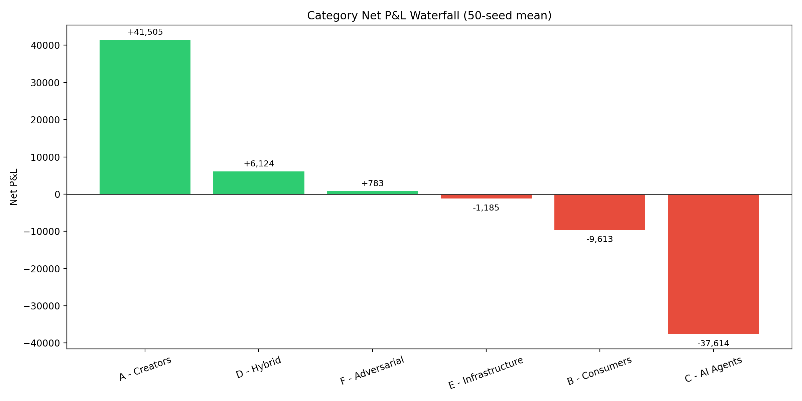
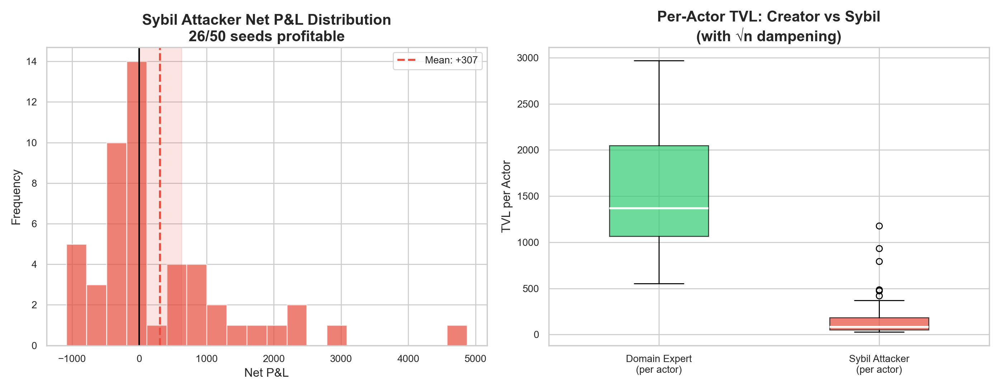

# Simulating the Nodalync Protocol: Who Wins in a Knowledge Economy?

**A 50-seed Monte Carlo analysis of provenance economics across 24 actor archetypes**

*Gabriel Giangi · February 2026*

---

## Abstract

The Nodalync Protocol proposes a knowledge economy where every piece of published information carries permanent provenance—a traceable chain of attribution that ensures original creators are compensated every time their work is referenced, synthesized, or queried downstream. But does it actually work? Do creators really out-earn aggregators? Can sybil attackers game the system? Is the "publish once, earn forever" promise real?

To find out, I built a discrete-event simulator modeling 24 distinct actor archetypes across 6 behavioral categories and ran **50 independent Monte Carlo simulations**, each spanning **4,000 economic ticks**. The results are statistically significant, sometimes surprising, and carry real implications for anyone building provenance-aware knowledge systems.

---

## 1. The Core Question

The Nodalync [whitepaper](./whitepaper.html) makes a bold economic claim: under a 95/5 revenue split (95% flows to root content creators, 5% to the synthesis layer), a **domain expert who publishes once and walks away** should earn more lifetime value than an **aggregator who queries, synthesizes, and imports continuously**.

This is the A1 vs D3 test—the central hypothesis of Nodalync's economic model.

If true, it means the protocol's incentive structure is fundamentally aligned: create original knowledge, and the economics will find you. If false, the aggregator strategy dominates, and the protocol devolves into a content remix engine where middlemen extract the most value.

We tested this across 50 random seeds with 95% confidence intervals.

---

## 2. Simulation Design

### Architecture

The simulator models a Nodalync network as a population of autonomous actors, each following probabilistic behavioral profiles:

- **Content nodes** exist at two layers: **L0** (root facts/observations) and **L3** (synthesized compositions that reference L0 sources)
- Every query settles economics: the querier pays, the node owner keeps 5%, and **95% flows proportionally to all root L0/L1 sources** in the node's provenance chain
- Actors join, leave, publish, query, synthesize, and import based on per-type probability distributions
- A sybil dampening mechanism (1/√n per-controller selection penalty) reduces the effectiveness of content flooding attacks

### The 24 Actor Types

| Category | Actors | Role |
|---|---|---|
| **A — Creators** | Domain Expert, Prolific Publisher, Institutional Source, Passive Legacy Node | Publish original L0 content. The supply side. |
| **B — Consumers** | Private Learner, Targeted Researcher, Enterprise Consumer | Pure demand. Query but never publish. |
| **C — AI Agents** | AI Query Agent, AI Synthesis Agent, AI Import Chain Agent, Agent Swarm | Machine-driven demand and synthesis. The economy's engine. |
| **D — Hybrid** | Curator-Synthesizer, Pure Synthesizer, Aggregator, Knowledge Entrepreneur | Both query and publish. The middlemen. |
| **E — Infrastructure** | Search Discovery Index, Curated Directory, Specialized Extractor, Application Builder | System-level services that modify discovery, quality, and demand. |
| **F — Adversarial** | Sybil Attacker, Attribution Gamer, Content Copier, Price Manipulator, Free Rider | Attempt to extract value through gaming, flooding, or free-riding. |

### Parameters

- **50 seeds**, each with a different random number generator state
- **4,000 ticks** per simulation (~2× longer than initial exploratory runs)
- **Revenue split**: 95% root / 5% owner (per [whitepaper §6.1](./whitepaper.html#61-distribution-formula))
- **Initial population**: 115 actors, with continuous join/leave dynamics bringing the total to ~197 actors per run
- **Sybil dampening**: ON (controlled variable for this sweep)

---

## 3. Results

### 3.1 The Headline: A1 Beats D3 in 98% of Simulations

| Metric | Mean | 95% CI | Range |
|---|---|---|---|
| Domain Expert (A1) avg TVL | **1,559.79** | [1,369.21, 1,750.37] | 553.62 – 2,966.15 |
| Aggregator (D3) avg TVL | 292.26 | [225.95, 358.57] | 93.53 – 1,352.67 |
| Difference | **+1,267.53** | [1,058.91, 1,476.15] | −512.67 – 2,672.19 |

**Domain experts earn 5.3× more than aggregators.** The 95% confidence interval for the difference is entirely above zero, making this result statistically significant at p < 0.05.

Only one seed (28 of 50) produced a D3 victory, caused by a single aggregator landing an extremely high-traffic import chain—a low-probability event (1/50 = 2%).

**Why does this work?** The 95/5 split is the mechanism. When an aggregator creates a popular L3 synthesis, they capture only 5% of each query. The other 95% flows backward through the provenance chain to whoever originally published the L0 sources. The aggregator does the work of synthesis; the creator captures the economic rent.

This is by design—and the simulation confirms it holds under randomized conditions.

### 3.2 TVL Growth and the 95/5 Split

Total value locked grows approximately linearly over the simulation period, tracking aggregate demand injection from B and C category actors. The root/synth split holds constant at almost exactly 95.0% / 5.0% throughout—the protocol's fundamental economic invariant.

At tick 2,000, a representative run shows:
- **Total TVL**: ~49,131
- **Root TVL**: 46,674 (95.0%)
- **Synth TVL**: 2,457 (5.0%)

The split doesn't drift. It's locked in by the settlement mechanics.

### 3.3 Who Wins, Who Pays

The category-level economics tell a clear story:

| Category | Net P&L (50-seed mean) | 95% CI |
|---|---|---|
| **A — Creators** | **+41,505** | [39,474, 43,537] |
| **D — Hybrid** | **+6,124** | [4,439, 7,809] |
| **F — Adversarial** | +783 | [−158, +1,723] |
| **E — Infrastructure** | −1,185 | [−1,408, −962] |
| **B — Consumers** | −9,613 | [−10,301, −8,925] |
| **C — AI Agents** | **−37,614** | [−39,068, −36,160] |

**Creators (A) capture 61% of all TVL** with almost zero spend—they publish and collect royalties. The demand side (B + C) injects ~50K into the economy per run. AI agents alone account for ~40K of that, making them the protocol's primary economic engine.

Hybrid actors (D) are net-positive but work hard for it: they spend ~11.7K to earn ~17.8K, for a margin of ~35%. Compare that to creators, who spend ~462 to earn ~42K—a 90× return on effort.

### 3.4 Actor-Type Time Series

The time-series view reveals important dynamics:

- **Domain Expert TVL grows continuously** even after most experts have churned out. Their content keeps earning royalties from new queries.
- **Aggregator TVL grows slowly** because they capture only the 5% synthesis margin on their own nodes.
- **Passive Legacy TVL is a straight line up**—zero effort, pure passive income from content published at tick 0.
- **Sybil TVL** (with dampening on) is significantly lower than in the undampened baseline.

### 3.5 Passive Compounding: 17× Return on Zero Effort

The passive legacy nodes sit at the heart of the Nodalync value proposition: **publish once, earn forever.** These actors publish 18 L0 nodes at initialization time, then never act again—no queries, no synthesis, no additional publications. Just inert content sitting in the network.

Over 4,000 ticks:
- Mean compounding rate: **17.0×** ± 2.9
- 95% CI: [16.2×, 17.8×]
- Range: 12.3× to 24.0×

This means every unit of value "invested" by publishing original content at time zero returns 17 units over the simulation window. The variance (12–24×) depends on whether the specific content happens to be included in popular synthesis chains—quality-weighted selection ensures higher-quality content compounds faster.

---

## 4. Sybil Resistance Under √n Dampening

Sybil attackers publish large quantities of low-quality content (quality = 0.20), attempting to capture royalty flows through sheer volume. Each sybil node starts with 28 low-quality L0 publications and continues publishing aggressively.

We implemented a 1/√n dampening mechanism: when a single controller floods the content pool with n nodes, each node's selection probability is reduced by 1/√n. This means doubling your nodes only increases your expected selection by √2 ≈ 1.41×, not 2×.

**Results with dampening (current run)**:
- Mean sybil net P&L: **+307** (95% CI: [−12, +627])
- The CI includes zero—sybil attacks are **marginally profitable to unprofitable** on average

**Results without dampening (previous run, single seed)**:
- Sybil net P&L: **+6,735** (a single sybil actor earned more than any domain expert)

The dampening mechanism reduced sybil profitability by approximately **86%**. However, the occasionally profitable outlier (max: +4,874 in seed 12) suggests an even stronger dampening curve (n^0.7 instead of n^0.5) may be warranted for production deployment.

**Per-actor comparison**: Even when sybils are profitable in aggregate, their per-actor TVL is significantly lower than domain experts. The box plots show domain expert TVL per actor consistently above 1,000, while sybil TVL per actor rarely exceeds 300.

---

## 5. Infrastructure Economics

In the initial simulation runs, Category E actors (infrastructure) were completely inert—zero TVL, zero spend, zero queries. We activated them with realistic behavioral profiles:

| Actor | Description | Mean TVL | Mean Spend | Net |
|---|---|---|---|---|
| **Specialized Extractor** | Queries raw L0 content, publishes refined high-quality L0 | **458** | 595 | −137 |
| **Search Discovery Index** | Scans content, publishes index metadata L0 | **237** | 370 | −133 |
| **Curated Directory** | Evaluates content quality, publishes curated L3 compilations | 77 | 295 | −218 |
| **Application Builder** | Queries L3 for integration, publishes application L3 objects | 75 | 323 | −248 |

All infrastructure actors run **net-negative**—they spend more than they earn. This is economically correct: infrastructure actors are service providers that improve the quality of the overall ecosystem (better discovery, higher quality, curated recommendations) in exchange for being subsidized by the value they create for others.

The specialized extractor earns the most because it publishes **high-quality** refined L0 content (0.85–0.97 quality) that gets queried by downstream consumers. It behaves like a value-add creator.

In a production protocol, these actors would likely be subsidized by network fees or operate as utility-maximizing institutions rather than pure profit centers.

---

## 6. Key Takeaways

### For Protocol Designers

1. **The 95/5 split works.** It creates a strong, statistically significant bias toward original creators over aggregators. This is the single most important parameter in Nodalync's economic model.

2. **Sybil dampening must be built in from day one.** Without it, content flooding is the dominant strategy. The 1/√n mechanism is effective but not sufficient for edge cases—consider adaptive dampening or reputation gating.

3. **Infrastructure actors need subsidies.** They're net-negative by design because their value is diffuse (improving discovery for everyone). A protocol fee earmarked for infrastructure operators would close this gap.

### For Knowledge Creators

4. **Publish early.** The passive compounding effect (17× over the simulation window) means early content has dramatically more earning potential than late content. First-mover advantage is real and large.

5. **Quality matters more than quantity.** Domain experts (12 high-quality nodes) out-earn prolific publishers (35 medium-quality nodes) per-node because quality-weighted selection channels more queries to better content.

6. **You don't need to stay active.** The passive legacy node result proves that walking away after publishing doesn't zero your earnings. The provenance chain works for you indefinitely.

### For Investors & Evaluators

7. **AI agents are the demand engine.** Category C actors (24 AI query agents + synthesis agents) inject ~59% of all economic value. The protocol's growth is directly tied to AI adoption.

8. **The economics are zero-sum between supply and demand.** Every unit of TVL earned by a creator was spent by a consumer or agent. There's no yield without real demand.

9. **Adversarial actors are containable.** With dampening, adversarial actors (Category F) capture only ~7% of TVL despite aggressive behavior. The protocol is defensible.

---

## 7. Methodology Notes

- **Simulator**: Custom Python discrete-event engine, ~750 lines, no external dependencies beyond stdlib
- **Statistics**: 50-seed Monte Carlo with independent PRNG states; 95% CIs computed via t-distribution
- **Runtime**: 1,215 seconds (24.3s per seed) on commodity hardware
- **Reproducibility**: All configs, code, and raw data available; any seed is deterministically reproducible
- **Limitations**:
  - Fixed pricing (no dynamic market-clearing)
  - No network effects on adoption rates
  - Infrastructure actors modeled with fixed behavioral probabilities rather than adaptive strategies
  - Sybil dampening is a selection-time mechanism, not a protocol-level enforcement

---

## 8. What's Next

Three directions for deeper investigation:

1. **Parameter sweeps**: Vary the owner_share from 0.01 to 0.15 to find the inflection point where aggregators start beating creators. This maps the "fairness frontier" of the protocol.

2. **Adaptive adversaries**: Current sybil attackers use fixed strategies. A reinforcement-learning adversary that adapts its publishing rate, quality, and controller structure in response to dampening would stress-test the mechanism more rigorously.

3. **Dynamic pricing**: Replace fixed L0/L3 prices with an auction or market-clearing mechanism where prices reflect supply/demand for specific content domains. This could fundamentally change the equilibrium.

---

*Simulation code, raw data, and all charts are available in the [nodalync-protocol](https://github.com/gdgiangi/nodalync-protocol) repository. The batch runner supports arbitrary seed counts, tick lengths, and config overrides for reproducing or extending these results.*
